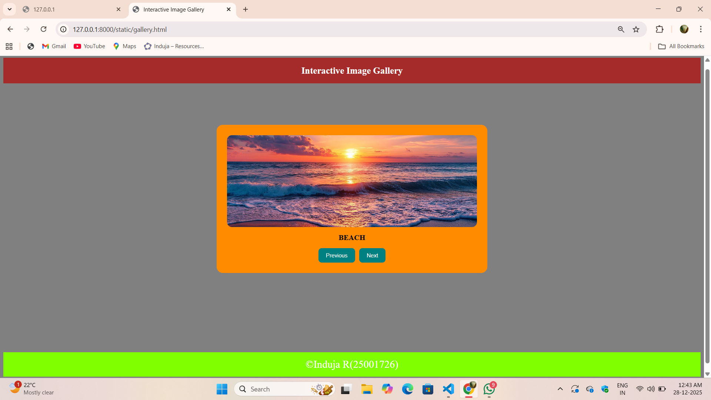

# Ex.07 Design of Interactive Image Gallery
## Date:28-12-2025

## AIM:
To design a web application for an inteactive image gallery for a minimum five images with next and previous buttons.

## DESIGN STEPS:

### Step 1:
Clone the github repository and create Django admin interface.

### Step 2:
Change settings.py file to allow request from all hosts.

### Step 3:
Use CSS for positioning and styling.

### Step 4:
Write JavaScript program for implementing interactivity.

### Step 5:
Validate the HTML and CSS code.

### Step 6:
Publish the website in the given URL.

## PROGRAM:
galery.html
```
<html>
<head>
    <title>Interactive Image Gallery</title>
    <link href="gallery.css" rel="stylesheet">
    <script src="gallery.js"></script>
</head>
<body>
<header>
    Interactive Image Gallery
</header>
<div class="main">
    <div class="card">
        
        <p id="Text">BEACH</p>
        <div class="btns">
            <button onclick="changeImage('prev')">Previous</button>
            <button onclick="changeImage('next')">Next</button>
        </div>
    </div>
</div>
<footer class="footer">
    &copy;Induja R(25001726)
</footer>
</body>
</html>
```
galery.css
```
body {
    background: gray;
    padding-top: 10px;
    padding-bottom: 10px;
}
header 
{
    background: brown;
    color: white;
    text-align: center;
    padding: 18px;
    font-size: 22px;
    font-weight:bolder;
}
.main 
{
    display: flex;
    justify-content: center;
    align-items: center;
    margin-top: 100px;
}
.card 
{
    background: darkorange;
    padding: 25px;
    border-radius: 15px;
    text-align: center;
    width: 600px;
    height:auto;
}
.card img {
    width: 100%;
    height: 220px;
    border-radius: 12px;
    object-fit: cover;
}
p
{
    margin: 15px 0;
    font-size: 18px;
    font-weight: 600;
}
.btns 
{
    display: flex;
    justify-content: center;
    gap: 10px;
}

.btns button 
{
    background:teal;
    color: white;
    border: none;
    padding: 10px 18px;
    border-radius: 8px;
    cursor: pointer;
}
.footer 
{
    background: chartreuse;
    color: white;
    text-align: center;
    padding: 15px;
    font-size: 25px;
    margin-top: 190px;
}
```
gallery.js
```
const gallery = [
    { src: "5.jpg", caption: "BEACH" },
    { src: "4.jpg", caption: "FOREST" },
    { src: "3.jpg", caption: "DESSERT" }
];
let index = 0;
function changeImage(type) {
    if (type === "next") 
    {
        index++;
        if(index >= gallery.length)
        {
            index = 0;
        }
    }
    if (type === "prev") 
    {
        index--;
        if(index < 0)
        {
            index = gallery.length - 1;
        }
    }
    document.getElementById("Image").src = gallery[index].src;
    document.getElementById("Text").innerText = gallery[index].caption;
}
```

## OUTPUT:

## RESULT:
The program for designing an interactive image gallery using HTML, CSS and JavaScript is executed successfully.
